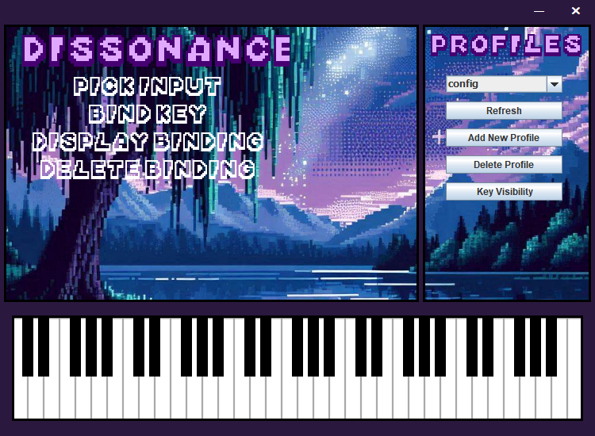

# Midi-Game-Controller
A little project to let me mess around with my midi keyboard as a computer input

This project is mostly complete, and whilst I'd like to continue to improve it I'm back at University, so I'd rather spend my time working on some new programs.
Maybe over the summer I'll look into adding some customisation and accessibility settings + some general GUI updates

Anyways, here's how it turned out 😊

